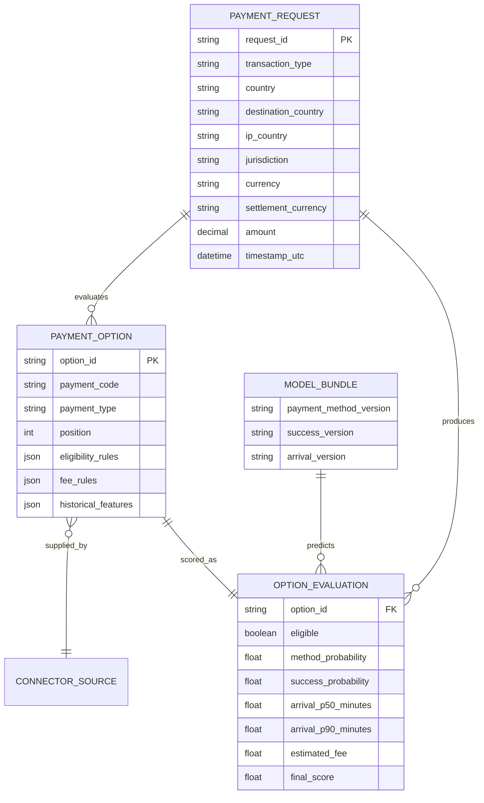

# Logical ERD

PayMind is stateless. These are contracts, not mandatory PayMind-owned tables.

```mermaid
erDiagram
  PAYMENT_REQUEST ||--o{ PAYMENT_OPTION : evaluates
  PAYMENT_OPTION }o--|| CONNECTOR_SOURCE : supplied_by
  PAYMENT_REQUEST ||--o{ OPTION_EVALUATION : produces
  PAYMENT_OPTION ||--|| OPTION_EVALUATION : scored_as
  MODEL_BUNDLE ||--o{ OPTION_EVALUATION : predicts

  PAYMENT_REQUEST {
    string request_id PK
    string transaction_type
    string country
    string destination_country
    string ip_country
    string jurisdiction
    string currency
    string settlement_currency
    decimal amount
    datetime timestamp_utc
  }
  PAYMENT_OPTION {
    string option_id PK
    string payment_code
    string payment_type
    int position
    json eligibility_rules
    json fee_rules
    json historical_features
  }
  OPTION_EVALUATION {
    string option_id FK
    boolean eligible
    float method_probability
    float success_probability
    float arrival_p50_minutes
    float arrival_p90_minutes
    float estimated_fee
    float final_score
  }
  MODEL_BUNDLE {
    string payment_method_version
    string success_version
    string arrival_version
  }
```
